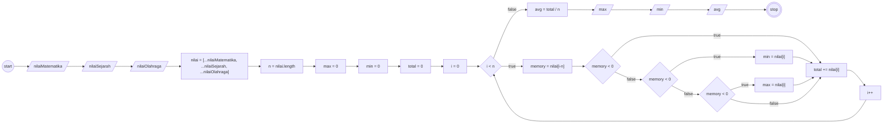

# Materi: Spread Operator

Mempelajari penggunaan spread operator.

## Soal 1

Membuat program hitung nilai max, min, dan average

### Flowchart

```mermaid

flowchart LR

start((start))
stop(((stop)))

mat[/nilaiMatematika/]
seja[/nilaiSejarah/]
olga[/nilaiOlahraga/]

nilai["nilai = [...nilaiMatematika, ...nilaiSejarah, ...nilaiOlahraga]"]

n[n = nilai.length]

index[i = 0]
checkIndex{i < n}

memory["memory = nilai[i-n]"]
total[total = 0]

max[max = 0]
inMax["max = nilai[i]"]
min[min = 0]
inMin["min = nilai[i]"]
avg[avg = total / n]

incIndex[i++]

addTotal["total += nilai[i]"]
outMin[/min/]
outMax[/max/]
outAvg[/avg/]

check1{memory < 0}
checkKecil{memory < 0}
checkBesar{memory < 0}

start --> mat --> seja --> olga --> nilai --> n --> max --> min --> total --> index --> checkIndex
checkIndex --true--> memory --> check1
check1 --true--> addTotal
check1 --false--> checkKecil
checkKecil --true--> inMin --> addTotal
checkKecil --false--> checkBesar
checkBesar --true--> inMax --> addTotal
checkBesar --false--> addTotal
addTotal --> incIndex --> checkIndex
checkIndex --false--> avg --> outMax --> outMin --> outAvg --> stop

```